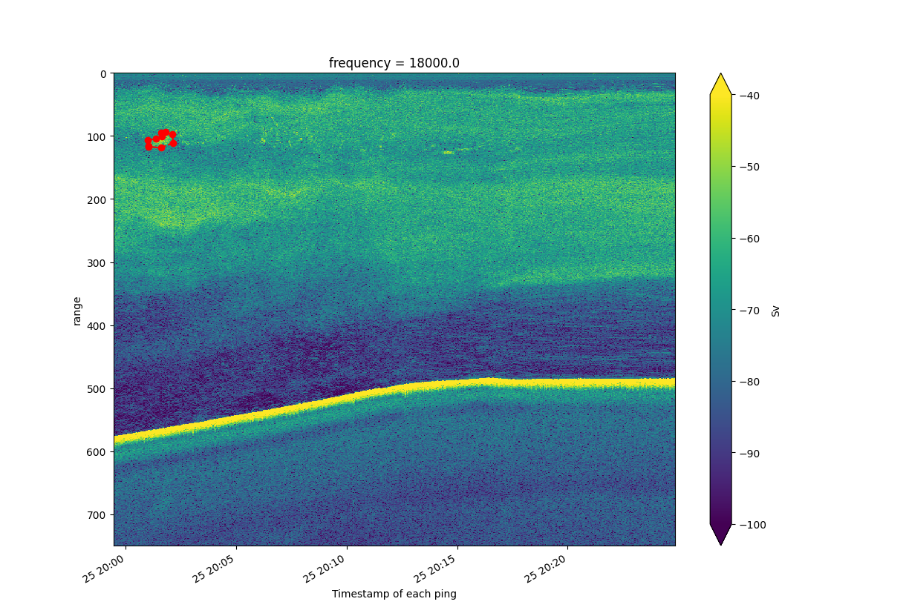
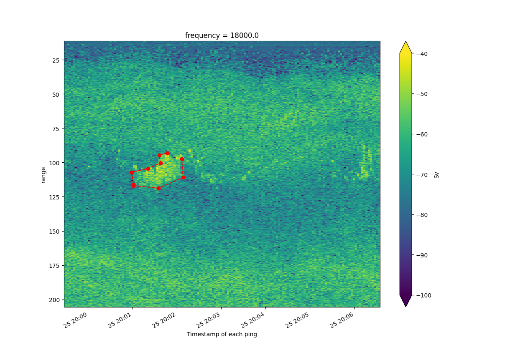

# EchoRegions

EchoRegions is a tool used for parsing and utilizing region files created in EchoView.

EchoRegions is designed with [Echopype](https://github.com/OSOceanAcoustics/echopype) in mind, and parsed region files will be able to mask or be overlaid on top of Echopype echograms. However, the EVR, EVL, and ECS parsers do not require Echopype to be installed.

## Functionality and Usage

### 2D Regions (EVR) files

To begin parsing and plotting EVR files with EchoRegions, create a Regions2D object and pass in your EVR file as a path string.

```python
>>> from echoregions import Regions2D
>>> r2d = Regions2D('echoregions/test_data/ek60/x1.evr')
```

Save the EVR file as a JSON or CSV file.

```python
>>> # Save to JSON
>>> r2d.to_json()

>>> # Save to CSV inside a folder called 'output'
>>> r2d.to_csv(save_dir='output')
```
Or call `parse_file` to store the regions data to `Regions2D.output_data` without saving a file to your disk.

Regions2D offers functions to help you work with points.

```python
>>> # List region ids
>>> r2d.regions
['1', '2', '3', '4', '5', '6', '7', '8', '9', '10', '11', '12', '13', '14', '15', '16', '17', '18', '19', '20', '22', '23', '24', '25', '26', '27', '28', '29', '30', '32', '33', '34', '35']
>>> # Get points from region
>>> points = r2d.get_points_from_region('11')
>>> points
[['D20170625T2001470930', '102.2552007996'], ['D20170625T2001361638', '103.7403107496'], ['D20170625T2001378879', '109.5322395548'], ['D20170625T2001212025', '113.5420364200'], ['D20170625T2000591807', '116.2152343301'], ['D20170625T2001014815', '125.1258940304'], ['D20170625T2001014815', '126.0169600004'], ['D20170625T2001350142', '127.9476029355'], ['D20170625T2002085357', '120.0765202002'], ['D20170625T2002068059', '106.7105306497']]
```

By default, a parsed file will have datetime as a string described [here](https://support.echoview.com/WebHelp/Reference/File_formats/Export_file_formats/2D_Region_definition_file_format.htm#Data_formats). For example: `D20170625T1612343335` for June 25, 2017 at 16:12:34.3335.

Convert these timestamps into a form that can be plotted (numpy datetime64) with:
```python
>>> r2d.convert_points(points)
[[array('2017-06-25T20:01:47.093000', dtype='datetime64[us]'), 102.2552007996], [array('2017-06-25T20:01:36.163800', dtype='datetime64[us]'), 103.7403107496], [array('2017-06-25T20:01:37.887900', dtype='datetime64[us]'), 109.5322395548], [array('2017-06-25T20:01:21.202500', dtype='datetime64[us]'), 113.54203642], [array('2017-06-25T20:00:59.180700', dtype='datetime64[us]'), 116.2152343301], [array('2017-06-25T20:01:01.481500', dtype='datetime64[us]'), 125.1258940304], [array('2017-06-25T20:01:01.481500', dtype='datetime64[us]'), 126.0169600004], [array('2017-06-25T20:01:35.014200', dtype='datetime64[us]'), 127.9476029355], [array('2017-06-25T20:02:08.535700', dtype='datetime64[us]'), 120.0765202002], [array('2017-06-25T20:02:06.805900', dtype='datetime64[us]'), 106.7105306497]]
```

This does not modify anything in-place, but the entire `Regions2D.output_data` can be converted in-place with:

```python
>>> r2d.convert_output()
```

*Keep in mind that this converted output is no longer JSON serializable, but it can still be saved as a CSV file.*

## Full plotting example

Below is an example of plotting a region onto an echogram produced by echopype.
```python
>>> from echoregions import Regions2D
>>> import matplotlib.pyplot as plt
>>> import xarray as xr
>>> import os
>>> import echopype as ep
>>
>>> # Parse region file
>>> data_dir = 'echoregions/test_data/ek60/'
>>> r2d = Regions2D(data_dir + 'x1.evr')
>>> r2d.parse_file()
>>>
>>> # Retrieve netcdf files produced by echopype
>>> raw_files = os.listdir('echoregions/test_data/ek60/hake_nc')
>>> raw_files
['Summer2017-D20170625-T175136.nc', 'Summer2017-D20170625-T181701.nc', 'Summer2017-D20170625-T184227.nc', 'Summer2017-D20170625-T190753.nc', 'Summer2017-D20170625-T193400.nc', 'Summer2017-D20170625-T195927.nc', 'Summer2017-D20170625-T202452.nc', 'Summer2017-D20170625-T205018.nc', 'Summer2017-D20170625-T211542.nc', 'Summer2017-D20170625-T214108.nc']
>>>
>>> # Select the file(s) that a region is contained in. Using region 11 in this case.
>>> file = r2d.select_raw(raw_files, '11')
>>> file
'Summer2017-D20170625-T195927.nc'
>>>
>>> # Calibrate the file with echopype
>>> ed = ep.process.EchoData(data_dir + 'hake_nc/' + file)
>>> proc = ep.process.Process('EK60', ed)
>>> proc.get_Sv(ed)
12:12:57  calibrating data in ['echoregions/test_data/ek60/hake_nc/Summer2017-D20170625-T195927.nc']
>>>
>>> # Get depth offset (m)
>>> plat = xr.open_dataset(data_dir + 'hake_nc/' + file, group='Platform')
>>> water_level = plat.water_level[0, 0].values
>>> water_level
array(9.14999962)
>>>
>>> # Plot echogram for one frequency
>>> ed.Sv['range'] = ed.Sv.range.isel(frequency=0, ping_time=0)
>>> ed.Sv = ed.Sv.swap_dims({'range_bin': 'range'})
>>> ed.Sv.Sv.isel(frequency=0).plot(x='ping_time', vmax=-40, vmin=-100, yincrease=False)
<matplotlib.collections.QuadMesh object at 0x000001B9073B6B50>
>>>
>>> # Plot region. Plot_region converts points automatically
>>> regions.plot_region(11, offset=water_level)
>>> plt.show()
```
### Plot output

### Zoomed plot output

